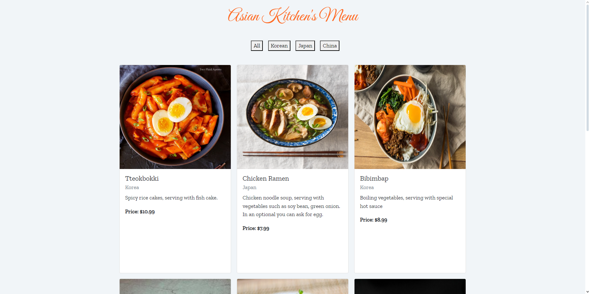

# Asian Kitchen Menu

## Overview

The Asian Kitchen Menu project is a web application that displays a menu of various Asian dishes. The menu items are categorized by their origin: Korea, Japan, and China. Users can filter the displayed items by category or view all items.

## Project Structure

- `index.html`: The main HTML file that sets up the structure of the web page.
- `style.css`: Contains the styles for the menu page.
- `app.js`: Contains the JavaScript logic for filtering and displaying menu items.

## Features

- **Display All Items**: View all available dishes.
- **Filter by Category**: Filter dishes by Korean, Japanese, or Chinese cuisine.
- **Responsive Design**: The menu is responsive and adapts to different screen sizes using Bootstrap.

## Getting Started

### Prerequisites

- A modern web browser.
- Internet connection for loading Bootstrap and Google Fonts.
