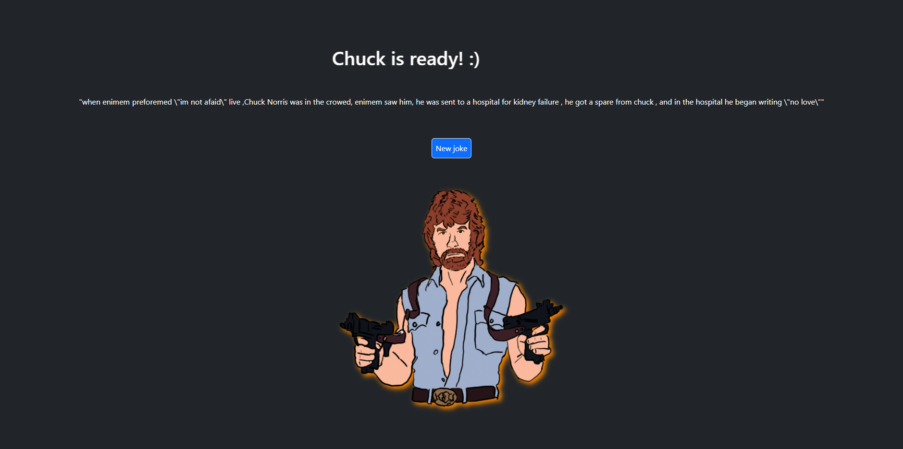

# Chuck Norris Joke Generator

This is a simple web application that fetches and displays random Chuck Norris jokes using the Chuck Norris API. The app is built using HTML, CSS, JavaScript, and Bootstrap for styling.

## Live



[Chuck Norris Generator](https://shnumtylmz.github.io/Patika.Dev-Front-End-Bootcamp/Week-5/JavaScript%20Chuck%20Norris%20Jokes/index.html)

## Features

- Fetches a random joke from the Chuck Norris API.
- Displays the joke on the screen.
- Button to fetch a new joke.
- Styled using Bootstrap for a modern look.
- Animated marquee text for the title.
- Image with drop-shadow effect.

## Technologies Used

- HTML
- CSS
- JavaScript
- Bootstrap

## Setup and Usage

1. **Clone the repository**:

    ```bash
    git clone https://github.com/yourusername/chuck-norris-joke-generator.git
    cd chuck-norris-joke-generator
    ```

2. **Open the `index.html` file in your browser**:

    You can simply open the `index.html` file in your preferred web browser to see the application in action.

3. **Get a new joke**:

    Click the "New joke" button to fetch and display a new random Chuck Norris joke.

## File Structure

- `index.html`: The main HTML file containing the structure of the web page.
- `style.css`: The CSS file for custom styles.
- `script.js`: The JavaScript file for fetching jokes and handling events.
- `chuck.png`: The image of Chuck Norris displayed on the page.