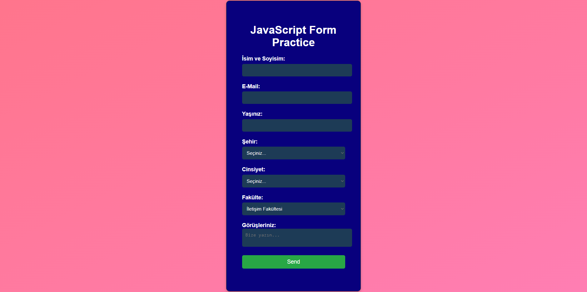

# JavaScript Form Practice

This project demonstrates how to collect user data through a form and send it to an API using JavaScript. The form includes fields for name, email, age, city, gender, faculty, and comments. Once the user submits the form, the data is sent to a mock API using the Fetch API.

## Project Structure



### 1. HTML (index.html)

The HTML file contains the form used to collect user information. The form includes:

- **Name**: Input field for the user’s name.
- **Email**: Input field for the user’s email.
- **Age**: Input field for the user’s age with min and max values.
- **City**: Dropdown for selecting the city.
- **Gender**: Dropdown for selecting gender.
- **Faculty**: Dropdown for selecting the faculty.
- **Comments**: Textarea for additional comments.

```html
<!DOCTYPE html>
<html lang="en">
<head>
    <meta charset="UTF-8" />
    <meta name="viewport" content="width=device-width, initial-scale=1.0" />
    <link rel="stylesheet" href="style.css" />
    <title>Document</title>
</head>
<body>
    <div class="container">
        <form id="form-survey" action="">
            <h1>JavaScript Form Practice</h1>
            <div class="form-group">
                <label for="name">Name: </label>
                <input type="text" name="name" id="name" required />
            </div>
            <div class="form-group">
                <label for="email">E-Mail: </label>
                <input type="email" name="email" id="email" required />
            </div>
            <div class="form-group">
                <label for="age">Age: </label>
                <input type="number" name="age" id="age" max="100" min="18" required />
            </div>
            <div class="form-group">
                <label for="city">City: </label>
                <select name="city" id="city">
                    <option value="empty" disabled selected>Select...</option>
                    <option value="Eskisehir">Eskisehir</option>
                    <option value="Istanbul">Istanbul</option>
                    <option value="Ankara">Ankara</option>
                </select>
            </div>
            <div class="form-group">
                <label for="sex">Gender: </label>
                <select name="sex" id="sex" required>
                    <option value="empty" disabled selected>Select...</option>
                    <option value="male">Male</option>
                    <option value="female">Female</option>
                </select>
            </div>
            <div class="form-group">
                <label for="faculty">Faculty: </label>
                <select name="faculty" id="faculty" required>
                    <option value="communication">Communication Faculty</option>
                    <option value="economics">Economics Faculty</option>
                    <option value="engineering">Engineering Faculty</option>
                    <option value="education">Education Faculty</option>
                </select>
            </div>
            <div class="form-group">
                <label for="comments">Comments: </label>
                <textarea name="comments" id="comments" placeholder="Write to us..."></textarea>
            </div>
            <div class="form-group">
                <button type="submit" id="btn">Send</button>
            </div>
        </form>
        <p id="output"></p>
    </div>
    <script src="script.js"></script>
</body>
</html>
