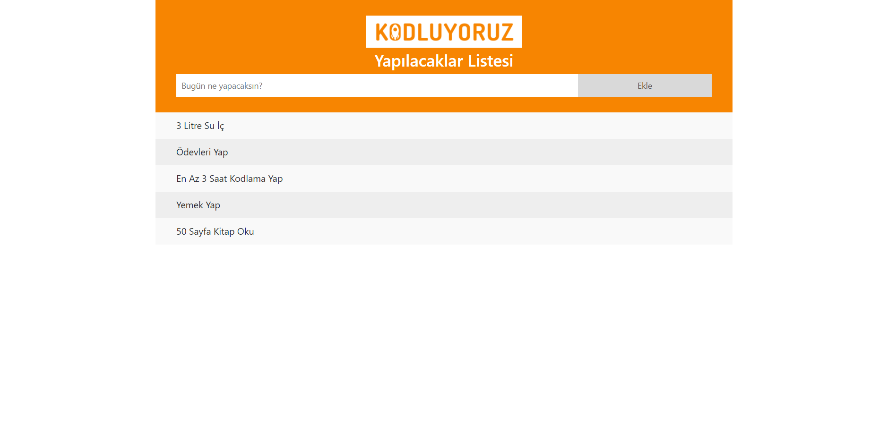

# To-Do List Application

This project is a simple to-do list application that allows users to add tasks, mark them as completed, and remove them. It also features toast notifications for success and error messages.

## Features

- **Add Tasks:** Users can input a task and add it to the list.
- **Mark Tasks as Completed:** Users can click on tasks to mark them as completed, which changes the background color and strikes through the text.
- **Remove Tasks:** Users can delete tasks by clicking the "X" button next to each task.
- **Toast Notifications:** Success and error messages are displayed using toast notifications.

## Technologies

- HTML
- CSS
- JavaScript
- Bootstrap 4
- FontAwesome

## Installation

1. **Download the Project Files**

   Download the project files, which include `index.html`, `style.css`, and `script.js`.

2. **Dependencies**

   The project uses Bootstrap and FontAwesome via CDN, so no additional installation is required.

3. **Open in Browser**

   Open `index.html` in a web browser to run the application.

## Usage

1. **Add a Task**

   Enter a task in the input field labeled "What will you do today?" and click the "Add" button to add the task to the list.

2. **Mark Tasks as Completed**

   Click on a task to mark it as completed. Completed tasks will have a light blue background and the text will be crossed out.

3. **Remove Tasks**

   Click the "X" button next to a task to remove it from the list.

4. **Toast Notifications**

   - An error toast message is displayed when trying to add an empty task.
   - A success toast message is shown when a task is successfully added.

## JavaScript Functions

- `newElement()`: Adds a new task to the list and displays the appropriate toast message.
- `closeButton(item)`: Adds a delete button to each task item.
- `taskCompleted(item)`: Adds a check icon to the task item and allows marking the task as completed.
- `showToast(toastClass)`: Displays toast messages based on the given class (`"success"` or `"error"`).

## CSS Styles

- Styles for tasks and toast messages are defined in `style.css`.
- Task background colors, font sizes, and clickable properties are customized.

---

Feel free to modify or expand this `README.md` based on your specific needs or additional features!
