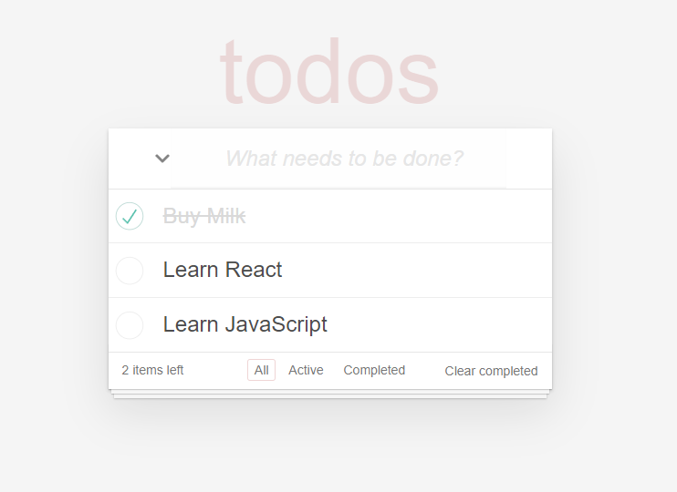

# TodoApp

TodoApp is a simple todo application built with React. The app allows you to add, edit, mark as completed, and filter your tasks. It also includes a feature to mark all tasks as completed.

## Features

- Add tasks
- Edit tasks
- Delete tasks
- Mark tasks as completed
- Clear completed tasks
- Filter tasks (All, Active, Completed)
- Mark all tasks as completed
