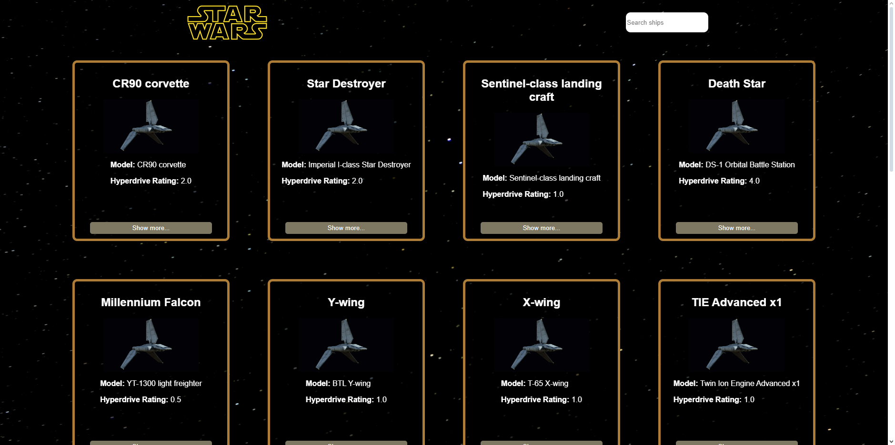

# Star Wars Starships Projesi

Bu proje, Star Wars evrenindeki uzay gemilerini listeleyen ve her bir gemi hakkında detaylı bilgiler sunan bir React uygulamasıdır. Uygulama, [SWAPI](https://swapi.dev/) API'sini kullanarak gemi verilerini çekmektedir. Kullanıcılar uzay gemileri arasında arama yapabilir ve daha fazla gemiyi yükleyebilirler.

## Özellikler

- **Gemileri Listeleme**: Star Wars evrenine ait gemiler, resimleri ve temel bilgileri ile birlikte listelenir.
- **Detay Sayfası**: Kullanıcılar, gemi kartlarındaki "Show more..." butonuna tıklayarak geminin daha detaylı bilgilerine ulaşabilir.
- **Arama Özelliği**: Kullanıcılar en az 3 karakter girerek gemiler arasında arama yapabilir.
- **Daha Fazla Yükleme**: Kullanıcılar, sayfanın alt kısmındaki "Load More Starships" butonuna tıklayarak daha fazla gemi yükleyebilir.
- **Responsive Tasarım**: Uygulama, tüm cihaz boyutlarına uyum sağlar.

## Kullanılan Teknolojiler

- **React**: Kullanıcı arayüzü için.
- **Context API**: Uygulama genelinde durum yönetimi için.
- **Axios**: API talepleri için.
- **CSS**: Uygulamanın stilizasyonu için.
